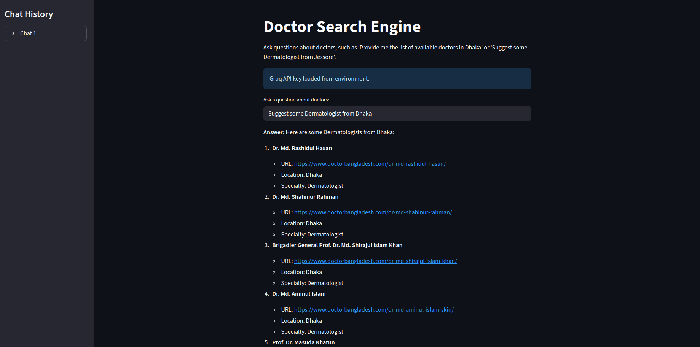
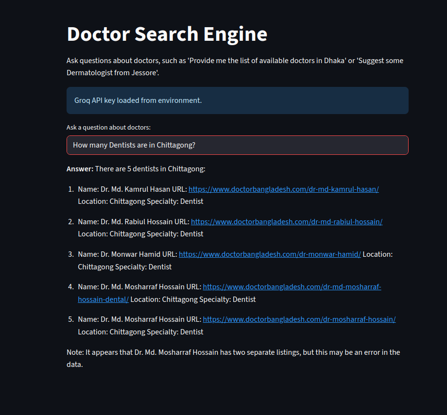
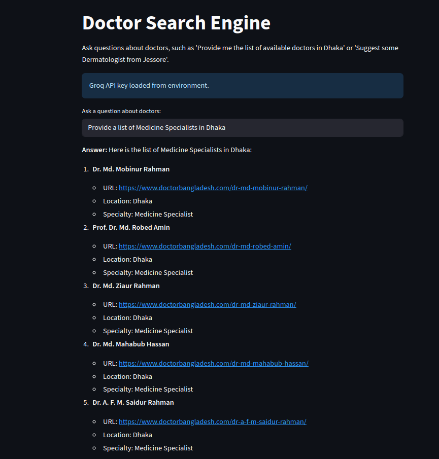
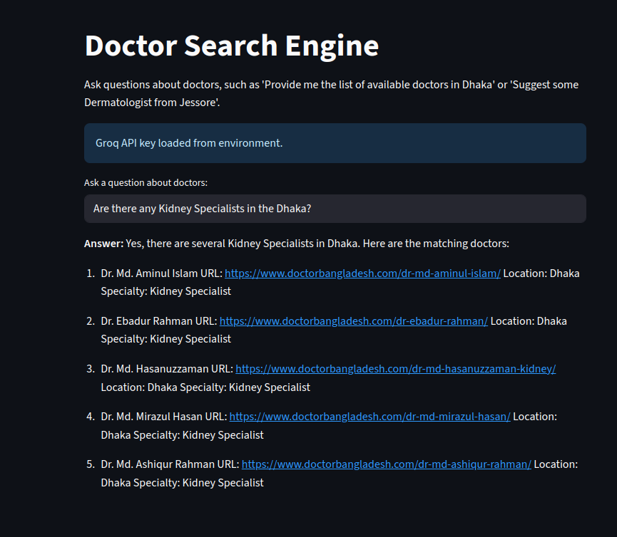

# Doctor Search Engine

The **Doctor Search Engine** is a Retrieval-Augmented Generation (RAG) system designed to provide information about doctors in Bangladesh. It uses data scraped from the [Doctor Bangladesh website](https://www.doctorbangladesh.com/), containing details of 5,362 doctors across various specialties and locations. The system leverages FAISS as a vector database for efficient similarity search and the Groq API for natural language processing to answer queries like "Provide me the list of available doctors in Dhaka" or "Suggest some Dermatologist from Jessore." The project includes a Streamlit-based web interface for interactive querying, with chat history displayed in a sidebar.




## Project Overview

- **Data Source**: Scraped data from [Doctor Bangladesh](https://www.doctorbangladesh.com/) using a Scrapy crawler.
- **Data Processing**: Cleaned and filtered doctor records to extract names, specialties, locations, and URLs.
- **RAG System**: Combines FAISS for document retrieval with Groq's language model to generate answers.
- **Frontend**: A Streamlit app (`app.py`) for user-friendly querying, with API key handling and chat history.
- **Backend**: Python scripts for data cleaning (`data_cleaning.py`) and RAG system logic (`doctors_rag_system.py`).

## Project Structure

```
.
├── app.py                      # Streamlit app for the doctor search interface
├── data_cleaning.py            # Script to clean and filter raw scraped data
├── dataset/                    # Directory for raw and cleaned data
│   ├── cleaned_data.json       # Filtered doctor data (name, specialty, location, URL)
│   └── raw_data.json           # Raw scraped data from Doctor Bangladesh
├── doctors_rag_system.py       # Core RAG system logic (FAISS + Groq)
├── faiss_index_doctors/        # FAISS vector store for doctor data
│   ├── index.faiss
│   └── index.pkl
├── mycrawler/                  # Scrapy project for data extraction
│   ├── mycrawler/
├── ui_images/                  # Screenshots and video of the UI
│   ├── sample_1.png
│   ├── sample_2.png
│   ├── sample_3.png
│   ├── sample_4.png
│   └── sample_video.webm
└── README.md                   
```

## Prerequisites

- **Python**: 3.11 or higher
- **Dependencies**:
  - `streamlit`
  - `langchain`
  - `langchain-community`
  - `langchain-huggingface`
  - `langchain-groq`
  - `python-dotenv`
  - `sentence-transformers`
  - `faiss-cpu`
  - `scrapy`
- **Groq API Key**: Required for the language model. Obtain from [Groq](https://console.groq.com/keys).
- **Hardware**: A system with sufficient memory to run FAISS and process the dataset (~5,362 records).

## Setup Instructions

1. **Clone the Repository**:
   ```bash
   git clone <repository-url>
   cd doctor-search-engine
   ```

2. **Install Dependencies**:
   Create a virtual environment and install required packages:
   ```bash
   python -m venv venv
   source venv/bin/activate  # On Windows: venv\Scripts\activate
   pip install streamlit langchain langchain-community langchain-huggingface langchain-groq python-dotenv sentence-transformers faiss-cpu scrapy

   #or
   #using yml file
   conda env create -f environment.yml
   conda activate doctor_search_engine
   ```

3. **Set Up Groq API Key**:
   Create a `.env` file in the project root and add your Groq API key:
   ```plaintext
   GROQ_API_KEY=your-groq-api-key-here
   ```
   Alternatively, the Streamlit app will prompt for the key if not found in `.env`.

4. **Prepare Data**:
   - The `dataset/cleaned_data.json` file contains filtered doctor data. If you need to reprocess raw data:
     - Ensure `dataset/raw_data.json` exists (output from Scrapy crawler).
     - Run the data cleaning script:
       ```bash
       python data_cleaning.py
       ```

5. **Build FAISS Vector Store**:
   - The vector store (`faiss_index_doctors/`) is generated automatically the first time you run `app.py` or `doctors_rag_system.py` if it doesn’t exist.
   - To build manually:
     ```bash
     python doctors_rag_system.py
     ```

## Usage

### Running the Streamlit App
1. Start the Streamlit app:
   ```bash
   streamlit run app.py
   ```
2. Open your browser to `http://localhost:8501`.
3. If the Groq API key is not in `.env`, enter it in the provided text input.
4. Ask questions in the text input field, e.g.:
   - "Provide me the list of available doctors in Dhaka"
   - "Suggest some Dermatologist from Jessore"
   - "List Child Specialists in Chittagong"
5. View responses in the main panel and chat history in the sidebar.

### Running the Command-Line RAG System
1. Run the RAG system directly:
   ```bash
   python doctors_rag_system.py
   ```
2. Enter queries at the prompt (e.g., "List Dentists in Comilla") and type `exit` to quit.

### Data Cleaning
To reprocess raw data:
```bash
python data_cleaning.py
```
This filters `dataset/raw_data.json` to produce `dataset/cleaned_data.json`, extracting doctor names, specialties, and locations from titles.

### Scraping New Data
To scrape fresh data from [Doctor Bangladesh](https://www.doctorbangladesh.com/):
1. Navigate to the Scrapy project:
   ```bash
   cd mycrawler
   ```
2. Run the spider:
   ```bash
   scrapy crawl site_spider -o output.json
   ```
3. Move `output.json` to `dataset/raw_data.json` and run `data_cleaning.py`.

## Data Description

- **Raw Data** (`dataset/raw_data.json`): Contains scraped data from Doctor Bangladesh, including URLs, titles, and content.
- **Cleaned Data** (`dataset/cleaned_data.json`): Filtered dataset with 5,362 doctor records, each containing:
  - `url`: Doctor’s profile URL (e.g., `https://www.doctorbangladesh.com/dr-md-shaukat-haidar/`)
  - `title`: Doctor’s name (e.g., "Dr. Md. Shaukat Haidar")
  - `specialty`: Medical specialty (e.g., "Dermatologist")
  - `location`: Practice location (e.g., "Jessore")
- **Source**: Scraped from doctor profiles (URLs starting with `https://www.doctorbangladesh.com/dr-`).

## Features

- **Query Types**: Supports queries by location, specialty, or both (e.g., "Dermatologists in Dhaka").
- **Response Format**: Returns doctor name, URL, location, and specialty.
- **Chat History**: The Streamlit app saves and displays query history in the sidebar.
- **Vector Store**: FAISS enables fast similarity search over doctor records.
- **Flexible API Key Handling**: Loads Groq API key from `.env` or user input.

## Example Queries

- **Location-Based**:
  - "Provide me the list of available doctors in Dhaka"
  - "List all doctors available in Jessore"
- **Specialty-Based**:
  - "Suggest some Dermatologist from Jessore"
  - "List Dentists in Comilla"
- **Combined**:
  - "Provide me the list of available doctors in Dhaka specialized in Child Specialist"
  - "Find Urologists in Khulna"

## Screenshots

See the `ui_images/` directory for screenshots and a demo video:
- `sample_1.png`: Main app interface
- `sample_2.png`: Samle Query input and response
- `sample_3.png`: Samle Query input and response
- `sample_4.png`: Samle Query input and response
- `sample_video.webm`: Demo of the app in action




